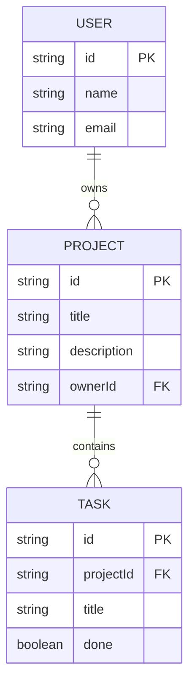

ERD (PoC) - Mermaid

MongoDB design notes:
- Users: own projects -> reference (store userId in project)
- Projects: may embed small arrays of metadata; tasks can be a separate collection and reference projectId if tasks grow large.

Embedding vs referencing:
- Embed tasks in project only if number of tasks per project is small and tasks are always fetched with project.
- Use referencing for tasks when tasks are large, numerous, or accessed independently.